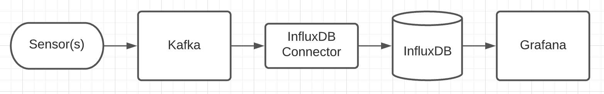
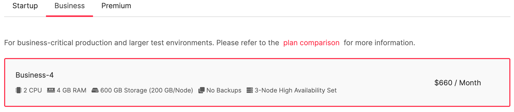
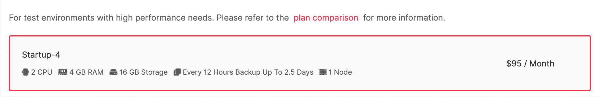
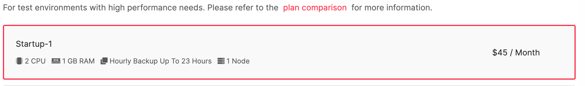
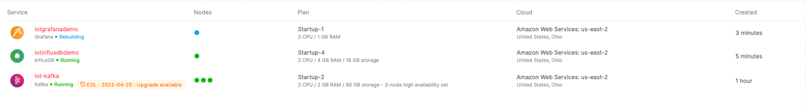
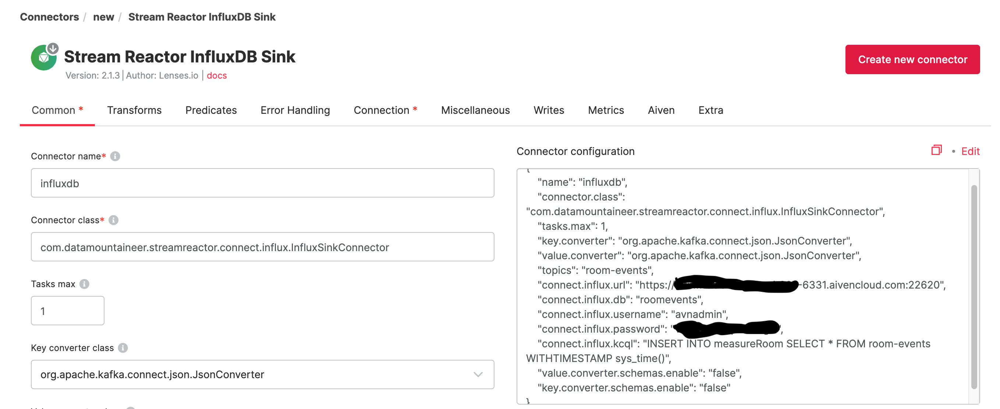
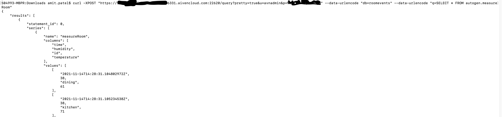
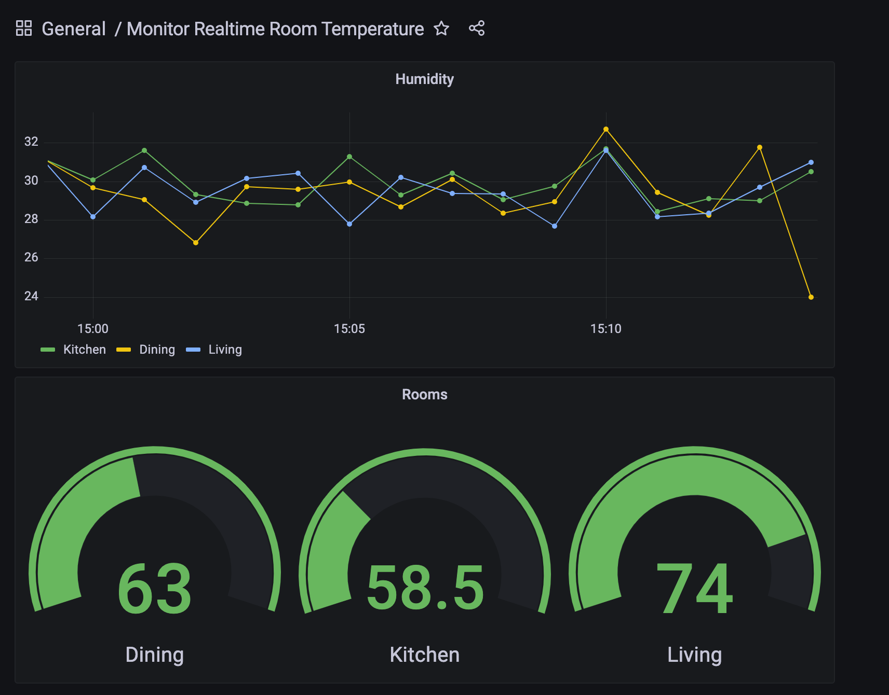

# Monitoring room temperature in realtime with Aiven Kafka, InfluxDB, and Grafana 

This solution demonstrates how to monitor and analyze sensor data in near real-time using Aiven Kafka, InfluxDB, and Grafana. The article will guide you through each of the steps required for creating and setting up services, along with sample code for mocking the sensor data. Let’s understand each of the 4 components and their role within the data pipeline.

**[Aiven Kafka](https://aiven.io/kafka)** is a distributed messaging system based on the commit log for ingesting and processing streaming data in real-time. We will use Kafka producer to publish sensor record to cluster.

**[Stream Reactor InfluxDB Sink](https://docs.confluent.io/kafka-connect-influxdb/current/influx-db-sink-connector/index.html)** is for moving the event data from Kafka topic to InfluxDB.

**[InfluxBd]()** is a powerful time series database. We will use this to store our sensor data.

**[Grafana](https://aiven.io/grafana)** is used for analyzing the data. We will use the Grafana dashboard to track events and view the data.

### Architecture: 


Let’s walk through the steps required for creating each of the services and connectors. 

### Create Kafka Service 
Log in to **[Aiven Console](https://console.aiven.io/)** and then click on the **create a new service** button available on the right side of the page. This is a 5 step process to getting the service up an running :
  
1. Select Kafka from available services. There are multiple version available to select from. 
  
2. Select AWS Service Cloud Provider. You can pick any provider, but I chose to go with AWS.
  
3. Select Service Cloud Region closer to you. There are multiple regions available to pick from. I chose to go with Ohio.
  
4. Select Service Plan. For this exercise, we need to pick the plan available under business or premium. The startup plan does not offer a connector for syncing the data with influxDB. See the screen shot below for options that I selected for the lowest cost. 

5. Enter the unique name for the service and click the **create service** button under the Service Summary dialog box on the right side of the page.
   
### Create InfluxDb Service 
Click on the **create a new service** button available on the right side of the page. This is a 5 step process to getting the service up and running :
1. Select InfluxDB from available services. 
2. Select AWS as Service Cloud Provider. You can pick any provider, but I chose to go with AWS.
3. Select Service Cloud Region closer to you. There are multiple regions available to pick from. I chose to go with Ohio.
4. Select startup plan for this exercise.

5. Enter the unique name for the service and click the **create service** button under the Service Summary dialog box on the right side of the page.

### Create Grafana Service 
Click on the **create a new services** button available on the right side of the page. This is a 5 steps process to getting the service up an running :
1. Select Grafana from available services. 
2. Select AWS as Service Cloud Provider. 
3. Select Service Cloud Region closer to you. There are multiple regions available to pick from. I chose to go with Ohio.
4. Select  startup plan for this exercise.
5. Enter the unique name for the service and click the **create service** button under the Service Summary dialog box on the right side of the page. 

There are a few additional tweaks to ***Kafka Service*** before we can publish the data. It will take about 3-4 minutes before the service starts running. After which, there should be 3 services running. 

Perform the following steps under Kafka Service :
- Download Access key, Access certificate, and CA Certificate for creating java keystone and truststore. 
- Enable Kafka REST API options.
- Under advance configuration, enable below two options:
    * kafka_authentication_methods.certificate
    * kafka.auto_create_topics_enable
  
Run the two commands below to create keystore with the service key and service.cert files.

<pre><code>openssl pkcs12 -export -inkey service.key -in service.cert -out client.keystore.p12 -name service_key
</code></pre>
<pre><code>keytool -import -file ca.pem -alias CA -keystore client.truststore.jks
</code></pre>

Now that we have the basic configuration completed, we will use the below code to generate the mock data for room sensors. The data will be published to "room-events" topic. We don't need to manually create this topic, as the auto topic creation setting has been enabled in earlier steps. Now create a simple Java application for emulating sensor data.
`Dependencies`
```
<properties>
	<kafka.version>0.11.0.1</kafka.version>
</properties>
<dependencies>
	<dependency>
		<groupId>org.apache.kafka</groupId>
		<artifactId>kafka-clients</artifactId>
		<version>${kafka.version}</version>
	</dependency>
	<dependency>
		<groupId>org.projectlombok</groupId>
		<artifactId>lombok</artifactId>
		<version>1.18.22</version>
	</dependency>
	<dependency>
		<groupId>com.fasterxml.jackson.core</groupId>
		<artifactId>jackson-databind</artifactId>
		<version>2.12.5</version>
	</dependency>
</dependencies>
```

`Event and Key classes`
```
@Data
@Builder
public class Event {
    private String id;

    public Event(String id, String time, int humidity, int temperature) {
        this.id = id;
        this.time = time;
        this.humidity = humidity;
        this.temperature = temperature;
    }

    private String time;
    private int humidity;
    private int temperature;
}
```

`Main function`
 ```
public class Application {
        public static void main(String[] args) throws InterruptedException {

            String root = System.getProperty("user.dir");
            root += "/src/main/resources/";

            Properties props = new Properties();
            props.put("bootstrap.servers", "iotkafka-amit007-6331.aivencloud.com:22622");
            props.put("security.protocol", "SSL");
            props.put("ssl.truststore.location", root+"client.truststore.jks");
            props.put("ssl.truststore.password", "secret");
            props.put("ssl.keystore.type", "PKCS12");
            props.put("ssl.keystore.location", root+"client.keystore.p12");
            props.put("ssl.keystore.password", "secret");
            props.put("ssl.key.password", "secret");
            props.put("key.serializer", KafkaJsonSerializer.class.getName());
            props.put("value.serializer", KafkaJsonSerializer.class.getName());

            KafkaProducer<Key, Event> producer = new KafkaProducer<>(props);

            List<String> location = Arrays.asList("kitchen", "living", "dining");

            try {
                while (true) {
                    Event Event = getEvent(location);
                    producer.send(new ProducerRecord<Key, Event>("room-events", new Key(), Event));
                    Thread.sleep(1000);
                }
            } finally {
                producer.close();
            }
        }

        private static Event getEvent(List<String> location) {
            return Event.builder().id(location.get(getRandomNumberUsingInts(0, 3)))
                    .time( DateTimeFormatter.ISO_DATE_TIME.format(LocalDateTime.now()))
                    .temperature(getRandomNumberUsingInts(50, 80))
                    .humidity(getRandomNumberUsingInts(20, 40))
                    .build();
        }

        public static int getRandomNumberUsingInts(int min, int max) {
            Random random = new Random();
            return random.ints(min, max)
                    .findFirst()
                    .getAsInt();
        }
}
 ```


NOTE: The producer can be configured to publish the data to an individual partition based on the key.

Once you have successfully compile the mock application, run the program to publish the data to Kafka. To verify if the data is being published successfully, go to the Kafka overview page, notice the new “room-events” topic was created automatically. Click the topic, select message, and then click on the fetch button. You should receive your publish message here.

`Stream Reactor InfluxDB Sink`: Here we will set up InfluxDb Sync connector to get the data out of the Kafka topic and store into InfluxDb. 

- On the overview page, select the connectors tab. 
- Click on the new connector button, and then select Stream Reactor InfluxDB Sink.
- Fill out the details and click create a new connector. This will start sending your data to the InfluxDB. Remember, you must have the InfluxDB database created before you start the connector. You can monitor the log to see if there is any issue with your connector. Below is generated settings for the connector. 


```
{
    "name": "influxdb",
    "connector.class": "com.datamountaineer.streamreactor.connect.influx.InfluxSinkConnector",
    "tasks.max": "1",
    "key.converter": "org.apache.kafka.connect.json.JsonConverter",
    "value.converter": "org.apache.kafka.connect.json.JsonConverter",
    "config.action.reload": "restart",
    "errors.log.enable": "true",
    "errors.log.include.messages": "true",
    "topics": "room-events",
    "connect.influx.url": "https://<host url>:22620",
    "connect.influx.db": "roomevents",
    "connect.influx.username": "avnadmin",
    "connect.influx.password": "enter correct password",
    "connect.influx.kcql": "INSERT INTO measureRoom SELECT * FROM room-events WITHTIMESTAMP sys_time()",
    "connect.progress.enabled": "true",
    "value.converter.schemas.enable": "false",
    "key.converter.schemas.enable": "false"
}
```
NOTE: Notice we are sending JSON object without schema. Therefore, we need to disable the option to use the schema; otherwise, the connector will run into an error state.  


Run the below query to review stored data in InfluxDB.


```
curl -XPOST "<HOST URL>:22620/query?pretty=true&u=avnadmin&p=enteryourpassword" --data-urlencode "db=roomevents" --data-urlencode "q=SELECT * FROM autogen.measureRoom"
```




`Analytics Dashboard` Now in the final steps, setup the data source in Grafana, and create an appealing dashboard for monitoring your room temperature in real time. The credentials for connecting to Grafana dashboard can be found on the overview page of the service.




## Wrap up
In this article, we covered the end to end process of creating a data pipeline for ingesting the sensor data and monitoring the data in near real-time. 